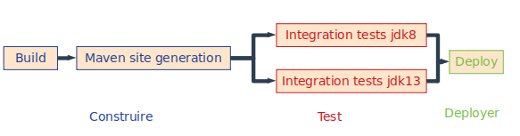

# Evaluation des compétences CI/CD

L’objet de ce travail pratique est de mettre en oeuvre de la livraison continue (“CD”) sur le projet suivant : 
https://github.com/dropwizard/dropwizard/tree/master/dropwizard-example.

# Outil d'IC : Travic IC

Pour mon projet, j'ai choisi d'utilisé le système d'integration continue libre le plus utilisé et ai donc choisi "Travis IC". 

# Le pipeline

Comme demandé dans le sujet, le pipeline est composé des étapes : Construire, Test, et Deployer.

* Construire : cette étage effectue la ligne de commande "mvn package" et génère une documentation de type maven site. Cette documentation est poussée sur la branche master. La stratégie utilisée pour le maven site est expliquée plus plus bas.

* Test : des tests d'integrations sont executés en parallèles sur deux versions je java : jdk8 et jdk13.

* Deployer : cette étape effectue ligne de commande "mvn deploy".

# Générer la documentation maven site

Afin de générer le maven site, j'utilise la commande "mvs site". j'ai tenté de pousser les document généré par la commande sur la branche master en utilisant le code suivant : https://gist.github.com/willprice/e07efd73fb7f13f917ea.

Le seule problème étant : le projet étant public, github supprime les token que je créé car leur ecriture en clair entraine des faille de sécurité.

# Générer une clée Trevic IC pour le projet github

Afin que Travis IC ai les droits sur le projet git hub, il faut ajouter dans le fichier travis.yml une clée de sécurité.

        
